<p align="center">
  
</p>

<p align="center">
  
</p>

---

# 👋 Hi, I'm Ritik Singh
### Full Stack Developer from India 🇮🇳

```
> Initializing developer profile...
> Status: Open for collaborations & full-time opportunities.
```

- 🚀 Developing scalable web architectures with **React & Next.js**
- ⚙️ Building robust, event-driven backends using **Node.js & Express**
- 🗄️ Designing optimized database schemas with **MongoDB & PostgreSQL**
- 🤖 Integrating **AI Applications** & LLM pipelines into software systems
- 🧠 Strong foundation in **Data Structures & Algorithms (DSA)** in **C++ & Python**

---

## 🛠️ Tech Stack

<p align="left">
  <!-- Frontend -->
  
  
  
  
  
  <br/>
  <!-- Backend & Database -->
  
  
  
  
  <br/>
  <!-- Tools & Core Languages -->
  
  
  
  
</p>

---

## 📊 GitHub Stats

<p align="center">
  
  
</p>

<p align="center">
  
</p>

---

## ✈️ Jet Heatmap

<p align="center">
  
</p>

---

## 🐍 Contribution Snake

<p align="center">
  <picture>
    <source media="(prefers-color-scheme: dark)" srcset="./github-contribution-grid-snake-dark.svg" />
    <source media="(prefers-color-scheme: light)" srcset="./github-contribution-grid-snake.svg" />
    
  </picture>
</p>

---

## 💬 Code Quote

```cpp
while (!success) {
    tryAgain();
}
```

---

## 🔗 Connect With Me

<p align="left">
  <a href="https://linkedin.com/in/ritik5504" target="_blank">
    
  </a>
  <a href="https://leetcode.com/ritik5504" target="_blank">
    
  </a>
  <a href="https://ritiksingh.dev" target="_blank">
    
  </a>
  <a href="mailto:ritiksingh.dev@gmail.com">
    
  </a>
</p>
